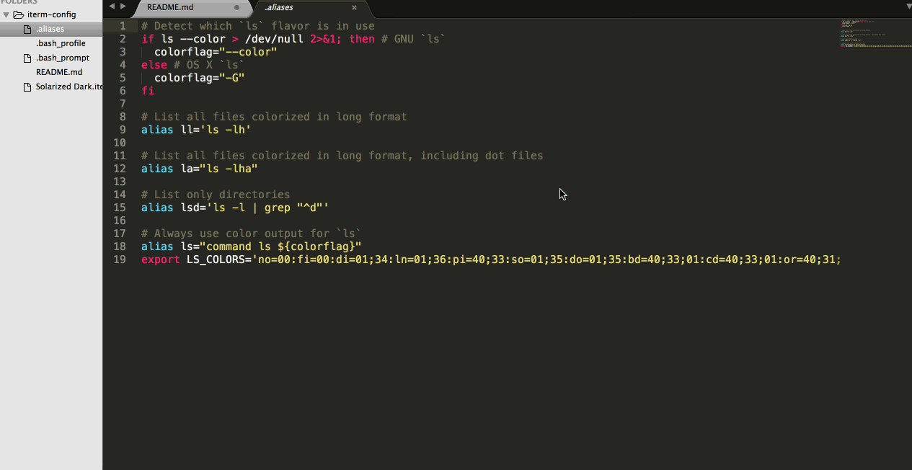

#Iterm 2 - Theme Configuration

##Automated Installation

Open a terminal window and execute the following command:

`>$ curl https://raw.githubusercontent.com/Angarsk8/solarized-dark-iterm/master/terminal_config.sh | sh`

Once it finishes, go to the last step.

##Manual Installation

###Modify .bash_profile

Open a terminal window and execute the following command:

`>$ nano ~/.bash_profile`

That command will open a nano text edior inside your terminal. Copy the text inside the **.bash_profile** file in this repository and paste it in the nano window. Then press `ctrl-x` to exit the window and `y` to save the file, and finally press `enter` to confirm the changes.

###Modify .bash_prompt

Execute the following command in a terminal shell:

`>$ nano ~/.bash_prompt`

Just as before, the excuted command will just open up a nano text editor window inside your terminal. Again copy the bash script inside the **.bash_prompt** file in this repo and paste it in the nano window. Then press `ctrl-x` to exit the window and `y` to save the file, and finally press `enter` to confirm the changes.

###Modify .aliases

Execute the following command in a terminal shell:

`>$ nano ~/.aliases`

Repeat the process listed in the above steps and save the changes as indicated.

##Change iTerm Theme (Solarized Dark Theme)

To change the iTerm theme to **Solarized Dark** you have to open iTerm, press `CMD + ,` to show the preferences window, then go to the Profiles tab and then to the Colors tab, scroll down to a dropdown menu that says **load presets** and pick the option _import_. Then the "Solarized Dark" option will be be available from the same dropdown menu. Just pick the theme you have just imported and have fun using your new fancy terminal.

